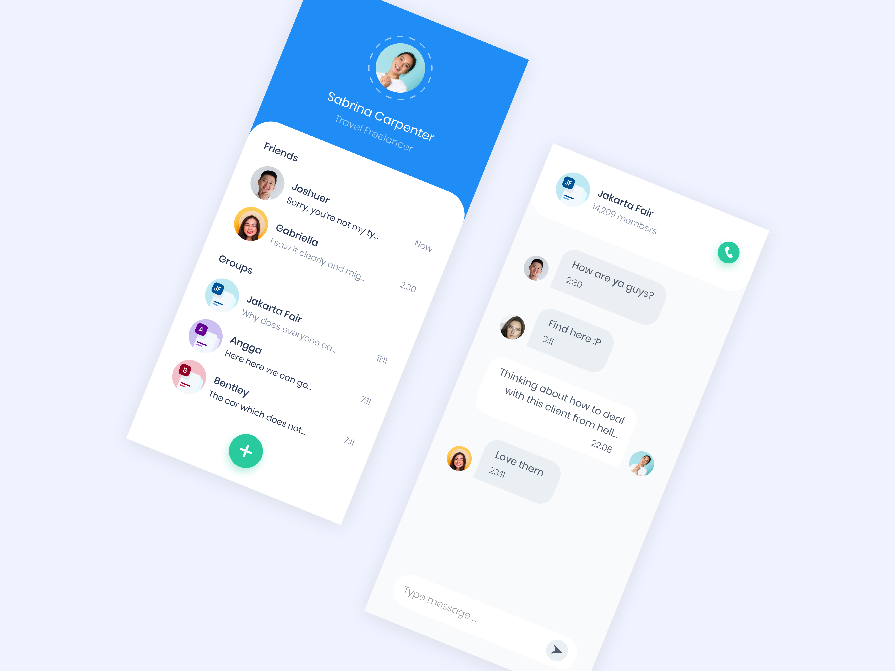
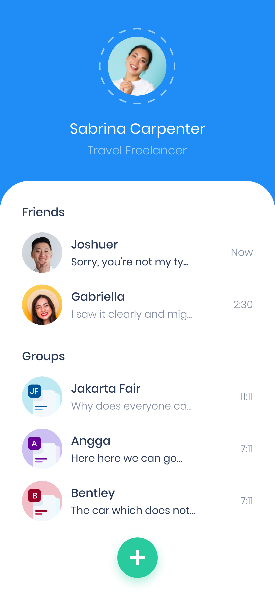
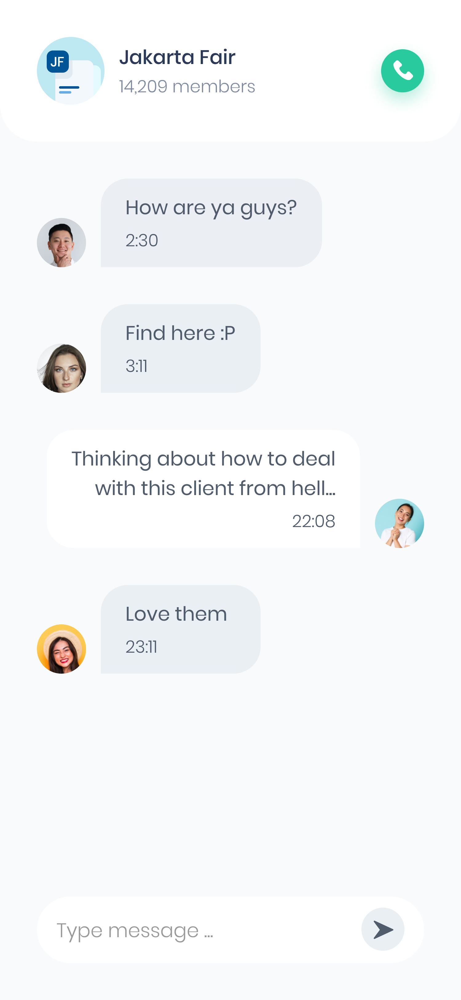

# chatty

A Slicing UI Practice Chat UI Apps (Chatty). From pixels BWA website.
**It only consists of 2 screens.**

Star⭐ the repo if you like.

## 📸 ScreenShots

| 1 | 2|
|------|-------|
|||

## Author(s)
**Tedo Haris Chandra**

# Special Thanks to : 
[BuildWithAngga](https://buildwithangga.com/) for Courses and [Pixel Build With Angga](https://pixel.buildwithangga.com/) for the UI Resources.

## Getting Started

This project is a starting point for a Flutter application.

A few resources to get you started if this is your first Flutter project:

- [Lab: Write your first Flutter app](https://flutter.dev/docs/get-started/codelab)
- [Cookbook: Useful Flutter samples](https://flutter.dev/docs/cookbook)

For help getting started with Flutter, view our
[online documentation](https://flutter.dev/docs), which offers tutorials,
samples, guidance on mobile development, and a full API reference.
